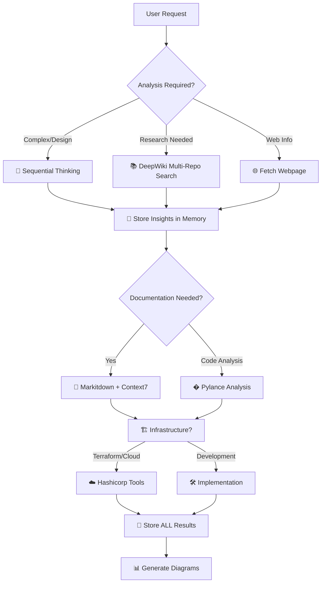
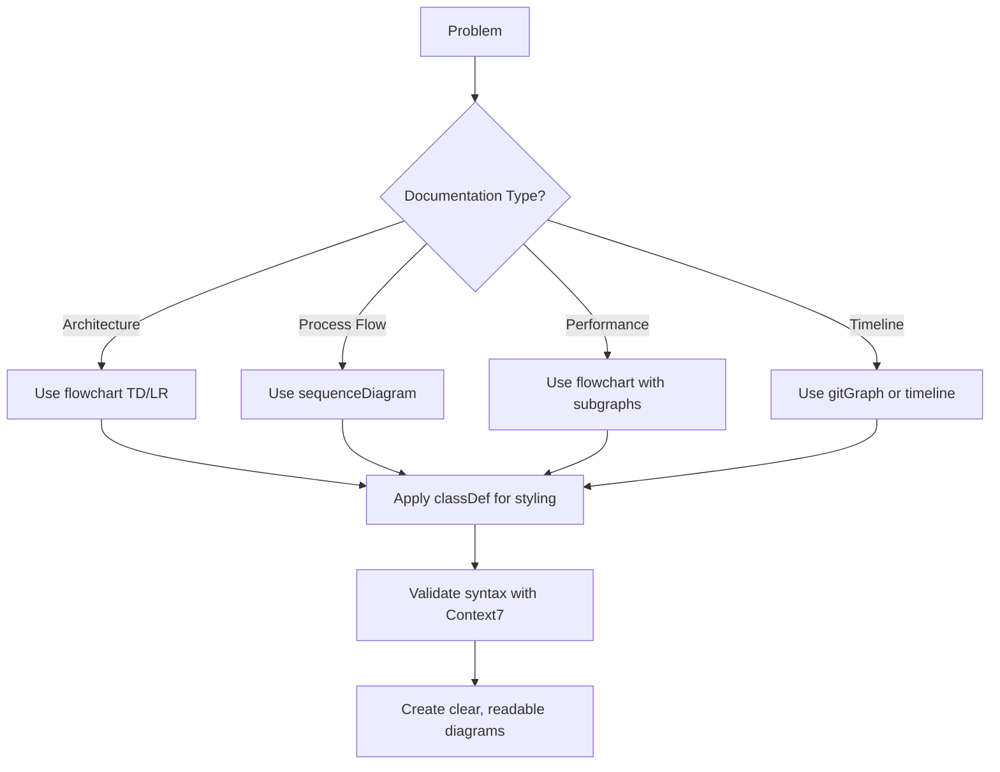
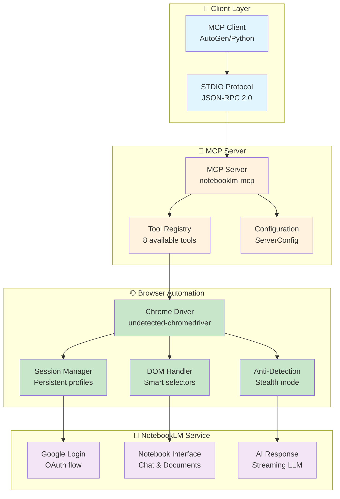
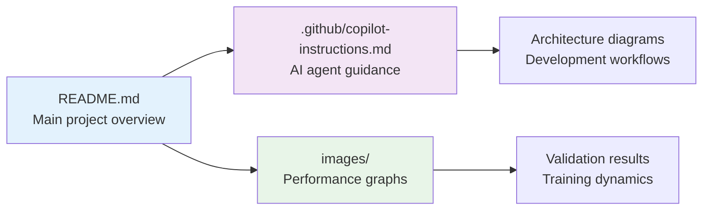

# 🤖 AI Agent Instructions for NotebookLM MCP Server

## 🎯 Project Overview
NotebookLM MCP Server is a professional Model Context Protocol (MCP) server for automating interactions with Google's NotebookLM. Features persistent browser sessions, streaming response support, and comprehensive automation capabilities using Selenium WebDriver with undetected-chromedriver.

## 🚨 **CRITICAL VALIDATION REQUIREMENTS**

### **🔬 FOR ALL REFACTOR/ENHANCE REQUESTS:**

**MANDATORY**: Always validate code changes with proper testing:

1. **Unit tests với pytest** - NOT bash terminal testing
2. **Integration tests** - Real functionality testing
3. **Import validation** - All modules must import correctly
4. **Dependency check** - All required packages available
5. **Function-by-function validation** - Each component tested individually

### **📝 Testing Standards:**
```python
# ✅ CORRECT: Proper unit testing
def test_config_validation():
    config = ServerConfig(timeout=-1)
    with pytest.raises(ConfigurationError):
        config.validate()

# ❌ WRONG: Bash terminal testing
# python -c "print('Test passed')"
```

### **� ABSOLUTE FUNCTION CHANGE CONSTRAINTS:**

**⚠️ CRITICAL RULE: NO FUNCTION CHANGES WITHOUT TESTS**

1. **ANY function modification** → MUST run `task enforce:test`
2. **Coverage requirement**: ≥95% or change is REJECTED
3. **All tests must pass** before function changes are accepted
4. **Breaking changes** require integration test validation

```bash
# MANDATORY after ANY function change
task enforce:test    # Runs coverage + lint + validation
task test:coverage   # Must show ≥95% coverage
```

### **🎯 Task Management with Taskfile:**

We use [Taskfile.dev](https://taskfile.dev/) instead of Makefile for better cross-platform support:

```bash
# Quick commands (memorize these)
task                    # Show all tasks
task test:quick        # Single test validation
task test:unit         # Full unit test suite
task test:coverage     # Coverage validation (≥95%)
task dev:check         # Pre-commit validation
task enforce:test      # MANDATORY after function changes
```

### **💾 Memory Documentation Strategy:**

**ENHANCED MEMORY REQUIREMENTS**: Store project-specific patterns, not just results:

**🔍 STORE METHODOLOGY & WORKFLOW PATTERNS:**
- **User Environment**: conda vs local, uv vs poetry vs pip
- **Debug Patterns**: How user prefers to debug (print, logger, debugger)
- **Testing Patterns**: Which test commands user runs most
- **Development Flow**: User's typical development workflow
- **Deployment Preferences**: Docker, local, cloud preferences

**📊 PROJECT INSIGHTS TO REMEMBER:**
```python
# Example memory entities
development_environment = {
    "package_manager": "pip",  # vs poetry, uv
    "python_env": "conda",     # vs venv, pyenv
    "debug_style": "loguru",   # vs print, pdb
    "test_preference": "task test:unit",  # vs pytest directly
    "deployment": "docker"     # vs local, cloud
}
```

### **�💾 Memory Documentation:**
**ALWAYS** store significant findings in Memory MCP server:
- Bug solutions and patterns
- Architecture decisions and rationale
- Performance results and configurations
- Research insights and SOTA techniques
- **USER WORKFLOW PATTERNS** (new requirement)
- **PROJECT-SPECIFIC METHODOLOGIES** (new requirement)

## 🧠 **COMPREHENSIVE MCP TOOLCHAIN STRATEGY**

### **🎯 MANDATORY: Always Use ALL Available MCP Tools Systematically**

**NEVER work in isolation - ALWAYS leverage the full MCP ecosystem for maximum effectiveness!**



### **🔧 COMPLETE MCP SERVER ARSENAL - 500+ TOOLS AVAILABLE**

**🔥 COMPREHENSIVE ECOSYSTEM - NEVER WORK IN ISOLATION!**

| 🎯 Category | MCP Servers | Primary Use | Integration Examples |
|-------------|-------------|-------------|---------------------|
| **🧠 Cognitive** | Sequential Thinking, Think Tools | Complex reasoning, multi-step analysis | Plan architecture, debug complex issues |
| **💾 Knowledge** | Memory, Extended Memory, LSpace | Store/retrieve insights, project continuity | Track experiments, save decisions |
| **📚 Research** | DeepWiki, GitHub, arXiv, PubMed, bioRxiv | Multi-repo research, academic papers | SOTA techniques, code patterns |
| **📊 Documentation** | Context7, Markitdown, Docy | Library docs, format conversion | Best practices, API documentation |
| **🔍 Code Analysis** | Pylance, Sourcerer, Language Server | Python analysis, semantic search | Code quality, imports, refactoring |
| **☁️ Infrastructure** | Hashicorp Terraform, AWS, Docker, Kubernetes | Cloud resources, deployment | Infrastructure as code |
| **🌐 Web & Search** | Fetch Webpage, Google Search, Tavily, Perplexity | Real-time information, web research | Trends, documentation, profiles |
| **�️ Databases** | PostgreSQL, MySQL, MongoDB, BigQuery, Snowflake | Data operations, analytics | Query, schema inspection |
| **🔐 Security** | CVE Intelligence, MalwareBazaar, Shodan | Vulnerability scanning, threat intel | Security research, compliance |
| **📱 Communication** | Slack, Discord, Telegram, WhatsApp, Email | Messaging, notifications | Team coordination, alerts |
| **🎨 Media & Design** | Figma, Canva, Image Generation, Video Tools | Design, visual content | UI/UX, presentations, media |
| **📈 Analytics** | Google Analytics, Datadog, Prometheus | Monitoring, performance metrics | Business intelligence, system health |
| **💰 Finance** | Yahoo Finance, Stripe, Crypto APIs | Financial data, payments | Market analysis, transactions |
| **🔄 Automation** | GitHub Actions, Jenkins, Zapier | CI/CD, workflow automation | Development pipelines |
| **📝 Content** | Notion, Obsidian, WordPress, Content Management | Knowledge management, publishing | Documentation, blogging |
| **🎯 AI Services** | OpenAI, Anthropic, HuggingFace, Replicate | ML models, AI capabilities | Content generation, analysis |

---

## 🚀 **ENHANCED DEVELOPMENT WORKFLOWS - USING ALL TOOLS**

### **📋 Workflow 1: COMPLETE Research & Architecture Pipeline**

```python
# COMPREHENSIVE RESEARCH WORKFLOW
1. 🧠 mcp_sequentialthi_sequentialthinking()         # Strategic planning
2. 📚 mcp_deepwiki_ask_question() [MULTIPLE REPOS]   # SOTA research
   - microsoft/autogen, huggingface/transformers
   - pytorch/pytorch, facebookresearch/fairseq
3. 🌐 fetch_webpage() [LATEST TRENDS]                # Current developments
4. 📊 mcp_context7_get_library_docs()                # Official documentation
5. 🔍 mcp_pylance_mcp_s_pylanceImports()             # Code analysis
6. 💾 mcp_memory_create_entities()                   # Store ALL findings
7. 📝 mcp_markitdown_convert_to_markdown()           # Format documentation
8. ☁️ mcp_hashicorp_ter_search_modules()             # Infrastructure needs
9. 💾 mcp_memory_add_observations()                  # Final storage
```

### **📋 Workflow 2: FULL-STACK Development Cycle**

```python
# COMPLETE DEVELOPMENT PIPELINE
1. 🧠 mcp_sequentialthi_sequentialthinking()         # Plan features
2. 🔍 mcp_pylance_mcp_s_pylanceFileSyntaxErrors()    # Code validation
3. 📚 mcp_deepwiki_ask_question()                    # Best practices
4. 🔐 CVE Intelligence + Security Scanning           # Vulnerability check
5. 🗄️ Database Integration (PostgreSQL/MongoDB)      # Data layer
6. ☁️ Docker + Kubernetes deployment                 # Containerization
7. 📈 Monitoring setup (Datadog/Prometheus)          # Observability
8. 🔄 GitHub Actions CI/CD                           # Automation
9. 📝 Documentation generation                       # Comprehensive docs
10. 💾 mcp_memory_create_entities()                  # Archive project
```

### **📋 Workflow 3: RESEARCH PUBLICATION Pipeline**

```python
# ACADEMIC RESEARCH WORKFLOW
1. 🧠 mcp_sequentialthi_sequentialthinking()         # Research planning
2. 📚 arXiv + PubMed + bioRxiv search                # Literature review
3. 📊 Data analysis (Jupyter + Python execution)     # Experiments
4. 📈 Visualization (ECharts + Charts generation)    # Results presentation
5. 📝 LaTeX document preparation                     # Paper writing
6. 🔍 Grammar and style checking                     # Quality assurance
7. 💾 Version control and collaboration              # Git management
8. 📤 Submission preparation                         # Final formatting
```

---

## 🎯 **COMPREHENSIVE TOOL INTEGRATION MATRIX**

| Task Type | 🧠 Think | 💾 Memory | 📚 Research | 🌐 Web | 📊 Docs | 🔍 Code | ☁️ Infra | 🗄️ DB | 🔐 Security | 📱 Comm |
|-----------|----------|-----------|-------------|-----|---------|---------|----------|--------|-------------|----------|
| **Research** | ✅ Plan | ✅ Store | ✅ Multi-source | ✅ Trends | ✅ Format | ❌ | ❌ | ❌ | ❌ | ✅ Share |
| **Development** | ✅ Architect | ✅ Track | ✅ Patterns | ✅ Docs | ✅ Generate | ✅ Analyze | ✅ Deploy | ✅ Integrate | ✅ Scan | ✅ Notify |
| **Analytics** | ✅ Interpret | ✅ Historical | ✅ Methods | ✅ Reports | ✅ Present | ✅ Process | ✅ Scale | ✅ Query | ❌ | ✅ Alert |
| **Security** | ✅ Assess | ✅ Threats | ✅ Intel | ✅ Reports | ✅ Document | ✅ Audit | ✅ Harden | ✅ Monitor | ✅ Scan | ✅ Incident |
| **Deployment** | ✅ Strategy | ✅ Config | ✅ Best practices | ✅ Updates | ✅ Runbooks | ✅ Validate | ✅ Orchestrate | ✅ Migrate | ✅ Secure | ✅ Status |

---

## 🔥 **ADVANCED INTEGRATION PATTERNS**

### **🎯 Multi-Dimensional Problem Solving**
```python
# COMPREHENSIVE APPROACH TO ANY PROBLEM
problem_solving_matrix = {
    "technical_research": [
        "mcp_deepwiki_ask_question",      # GitHub repos
        "arxiv_search",                   # Academic papers
        "mcp_context7_get_library_docs",  # Official docs
        "stackoverflow_search"            # Community solutions
    ],
    "code_analysis": [
        "mcp_pylance_analysis",           # Python specifics
        "language_server_protocol",       # Multi-language
        "sourcerer_semantic_search",      # Code navigation
        "security_vulnerability_scan"     # Safety checks
    ],
    "infrastructure_planning": [
        "mcp_hashicorp_terraform",        # IaC
        "aws_services_integration",       # Cloud services
        "docker_containerization",        # Packaging
        "kubernetes_orchestration"        # Scaling
    ],
    "data_management": [
        "postgresql_operations",          # Relational data
        "mongodb_document_store",         # NoSQL
        "bigquery_analytics",             # Data warehouse
        "elasticsearch_search"            # Full-text search
    ],
    "monitoring_observability": [
        "prometheus_metrics",             # System metrics
        "datadog_apm",                   # Application performance
        "grafana_visualization",          # Dashboards
        "loki_log_aggregation"           # Log analysis
    ]
}
```

### **🔄 Recursive Enhancement Loops**
```python
# CONTINUOUS IMPROVEMENT CYCLE
enhancement_pipeline = [
    # 1. DISCOVERY PHASE
    ["sequential_thinking", "deepwiki_research", "web_search"],

    # 2. ANALYSIS PHASE
    ["pylance_analysis", "security_scanning", "performance_profiling"],

    # 3. IMPLEMENTATION PHASE
    ["code_generation", "testing_automation", "documentation"],

    # 4. DEPLOYMENT PHASE
    ["infrastructure_provisioning", "ci_cd_pipeline", "monitoring_setup"],

    # 5. VALIDATION PHASE
    ["quality_assurance", "security_audit", "performance_testing"],

    # 6. STORAGE PHASE
    ["memory_storage", "knowledge_indexing", "best_practices_capture"],

    # 7. FEEDBACK PHASE
    ["metrics_analysis", "improvement_identification", "cycle_restart"]
]
```

---

## 🎊 **MAXIMUM PRODUCTIVITY OUTCOMES**

**By leveraging the COMPLETE MCP ecosystem, every development session will:**

✅ **Research Phase**: Multi-source intelligence gathering
✅ **Analysis Phase**: Comprehensive code and security scanning
✅ **Implementation Phase**: Best practices and automation
✅ **Deployment Phase**: Infrastructure as code and monitoring
✅ **Documentation Phase**: Auto-generated, format-converted docs
✅ **Storage Phase**: Persistent knowledge and decision tracking
✅ **Communication Phase**: Automated notifications and reporting
✅ **Iteration Phase**: Continuous improvement with feedback loops

### **🔥 KEY INTEGRATION RULES**

1. **ALWAYS** start with Sequential Thinking for complex tasks
2. **ALWAYS** research with multiple sources (DeepWiki + Web + Context7)
3. **ALWAYS** store results in Memory for future reference
4. **ALWAYS** validate with Pylance and security tools
5. **ALWAYS** document with Markitdown and diagrams
6. **ALWAYS** consider infrastructure needs early
7. **ALWAYS** set up monitoring and observability
8. **ALWAYS** automate repetitive tasks
9. **ALWAYS** communicate progress and results
10. **ALWAYS** capture lessons learned for next iteration

**🚀 RESULT: Every task becomes a comprehensive, well-documented, secure, and scalable solution!**

---

## 🚀 **ENHANCED DEVELOPMENT WORKFLOWS**

### **📋 Workflow 1: Research & Architecture Design**

```python
# MANDATORY SEQUENCE - Use ALL tools
1. 🧠 mcp_sequentialthi_sequentialthinking()  # Plan approach
2. 📚 mcp_deepwiki_ask_question()              # Research multiple repos
3. 🌐 fetch_webpage()                          # Get latest trends
4. 💾 mcp_memory_create_entities()             # Store findings
5. 📊 mcp_context7_get_library_docs()          # Best practices
6. � mcp_markitdown_convert_to_markdown()     # Documentation
7. �💾 mcp_memory_add_observations()            # Store results
```

### **📋 Workflow 2: Code Analysis & Enhancement**

```python
# COMPREHENSIVE CODE REVIEW
1. 🔍 mcp_pylance_mcp_s_pylanceFileSyntaxErrors()    # Syntax check
2. 🔍 mcp_pylance_mcp_s_pylanceImports()             # Import analysis
3. 🧠 mcp_sequentialthi_sequentialthinking()         # Plan improvements
4. 📚 mcp_deepwiki_ask_question()                    # Research patterns
5. 📊 mcp_context7_resolve_library_id()              # Get docs
6. 🔍 mcp_pylance_mcp_s_pylanceInvokeRefactoring()   # Auto-refactor
7. 💾 mcp_memory_create_entities()                   # Store patterns
```

### **📋 Workflow 3: Infrastructure & Deployment**

```python
# FULL STACK DEPLOYMENT
1. 🧠 mcp_sequentialthi_sequentialthinking()         # Plan infrastructure
2. ☁️ mcp_hashicorp_ter_search_modules()             # Find modules
3. ☁️ mcp_hashicorp_ter_get_module_details()         # Get details
4. 📝 mcp_markitdown_convert_to_markdown()           # Document setup
5. 💾 mcp_memory_create_entities()                   # Store config
6. 🌐 fetch_webpage()                                # Latest practices
7. 💾 mcp_memory_add_observations()                  # Store learnings
```

---

## 🎯 **PROACTIVE TOOL INTEGRATION RULES**

### **🔍 ALWAYS Research First (Multi-Source)**
```python
# NEVER work without research
research_sources = [
    "mcp_deepwiki_ask_question()",      # Multiple GitHub repos
    "fetch_webpage()",                   # Web trends/docs
    "mcp_context7_get_library_docs()",   # Official docs
    "mcp_memory_search_nodes()"          # Existing knowledge
]
```

### **🧠 ALWAYS Think Systematically**
```python
# For ANY complex task (>3 steps)
if task_complexity > simple:
    mcp_sequentialthi_sequentialthinking(
        thought="Break down problem systematically",
        totalThoughts=estimated_complexity
    )
```

### **💾 ALWAYS Store Knowledge**
```python
# MANDATORY after every significant operation
results = [research, analysis, implementation, learnings]
for result in results:
    mcp_memory_create_entities([{
        "entityType": "appropriate_type",
        "name": f"session_{datetime.now()}",
        "observations": [result]
    }])
```

### **📝 ALWAYS Document Comprehensively**
```python
# Multi-format documentation
documentation_pipeline = [
    "mcp_markitdown_convert_to_markdown()",  # Format conversion
    "create_mermaid_diagrams()",              # Visual representation
    "mcp_context7_resolve_library_id()",      # Reference docs
    "generate_examples()"                     # Practical usage
]
```

---

## 🔥 **ADVANCED INTEGRATION PATTERNS**

### **� Recursive Enhancement Loop**
1. **Research** → DeepWiki + Fetch Webpage + Context7
2. **Analyze** → Sequential Thinking + Pylance + Memory Search
3. **Implement** → Best practices from research
4. **Document** → Markitdown + Mermaid diagrams
5. **Store** → Memory with observations
6. **Validate** → Pylance analysis + Testing
7. **Deploy** → Hashicorp Terraform (if applicable)
8. **Repeat** → Continuous improvement

### **🎯 Multi-Dimensional Problem Solving**
```python
# COMPREHENSIVE approach to ANY problem
problem_dimensions = {
    "technical": "mcp_deepwiki + pylance + context7",
    "architectural": "sequential_thinking + memory",
    "documentation": "markitdown + mermaid_diagrams",
    "deployment": "hashicorp_terraform + web_research",
    "knowledge": "memory_storage + cross_referencing"
}
```

---

## 📊 **MCP TOOL USAGE MATRIX**

| Task Type | 🧠 Think | 💾 Memory | 📚 DeepWiki | 🌐 Web | 📊 Context7 | 🔍 Pylance | ☁️ Terraform | 📝 Markdown |
|-----------|----------|-----------|-------------|-----|-------------|------------|--------------|-------------|
| **Research** | ✅ Plan | ✅ Store | ✅ Multi-repo | ✅ Trends | ✅ Docs | ❌ | ❌ | ✅ Format |
| **Code Review** | ✅ Analyze | ✅ Patterns | ✅ Examples | ❌ | ✅ Best practices | ✅ Analysis | ❌ | ✅ Document |
| **Architecture** | ✅ Design | ✅ Decisions | ✅ SOTA | ✅ Trends | ✅ Patterns | ❌ | ✅ Infrastructure | ✅ Diagrams |
| **Documentation** | ✅ Structure | ✅ Reference | ✅ Examples | ✅ Standards | ✅ Formats | ❌ | ❌ | ✅ Convert |
| **Deployment** | ✅ Plan | ✅ Config | ✅ DevOps | ✅ Practices | ✅ Tools | ❌ | ✅ Modules | ✅ Docs |

---

## 🎊 **RESULT: MAXIMUM PRODUCTIVITY**

**By following these comprehensive workflows, every task will:**
- ✅ **Leverage ALL available knowledge sources**
- ✅ **Apply systematic thinking methodology**
- ✅ **Store learnings for future reference**
- ✅ **Generate professional documentation**
- ✅ **Follow industry best practices**
- ✅ **Create reusable patterns and templates**

**🔥 NEVER work in isolation again - ALWAYS use the full MCP toolchain!**

## 📊 Mermaid Diagram Standards

### **Always Use Correct Mermaid Syntax**



#### **Key Mermaid Best Practices:**
- **Always use `flowchart TD/LR`** instead of deprecated `graph TD/LR`
- **Use `classDef`** for styling instead of inline `style` commands
- **Subgraphs** for logical grouping: `subgraph name["Display Name"]`
- **Proper node shapes**: `[]` rectangle, `()` rounded, `{}` diamond, `(())` circle
- **Clear connections**: `-->` solid, `-.->` dotted, `==>` thick
- **Consistent naming**: Use descriptive IDs and labels

## 🔑 **NotebookLM MCP Server - Complete Integration Guide**

### **🚀 Current Status: PRODUCTION READY**
- ✅ **Package Structure**: Professional `src/` layout with proper imports
- ✅ **CLI Interface**: `notebooklm-mcp` command with rich formatting
- ✅ **MCP Server**: Full protocol support for AutoGen integration
- ✅ **Browser Automation**: undetected-chromedriver with persistent sessions
- ✅ **Configuration**: Comprehensive config management with validation
- ✅ **Testing**: Unit tests with pytest, integration tests
- ✅ **Docker**: Production containers with monitoring
- ✅ **Documentation**: Complete guides and examples

### **📋 Authentication Workflow (IMPORTANT):**

**🔄 First Time Setup:**
```bash
# 1. Install package
pip install -e .

# 2. Start interactive chat (creates profile)
notebooklm-mcp chat --notebook YOUR_NOTEBOOK_ID

# 3. Manual login ONCE (browser opens automatically)
# - Login with Google account
# - Navigate to notebook
# - Wait for complete load
# - Press Enter in terminal

# 4. Session saved! Future uses skip login
```

**⚡ Subsequent Uses:**
```bash
# No manual login needed - uses saved session
notebooklm-mcp chat --notebook YOUR_NOTEBOOK_ID
notebooklm-mcp server --notebook YOUR_NOTEBOOK_ID --headless
```

**🔧 Profile Management:**
- **Profile location**: `./chrome_profile_notebooklm/`
- **Session persistence**: Cookies/auth automatically saved
- **Re-authentication**: Only when Google security requires (normal)
- **Profile reset**: Delete profile folder to start fresh

### **💻 Usage Patterns:**

#### **1. Interactive Chat**
```bash
notebooklm-mcp chat --notebook YOUR_NOTEBOOK_ID
# Rich terminal interface with real-time responses
```

#### **2. MCP Server (AutoGen)**
```bash
notebooklm-mcp server --notebook YOUR_NOTEBOOK_ID --headless
# STDIO protocol for AutoGen McpWorkbench integration
```

#### **3. Testing & Debugging**
```bash
notebooklm-mcp test --notebook YOUR_NOTEBOOK_ID
notebooklm-mcp config-show
```

#### **4. Python API Direct**
```python
from notebooklm_mcp import NotebookLMClient, ServerConfig

config = ServerConfig(
    default_notebook_id="YOUR_ID",
    headless=True
)

client = NotebookLMClient(config)
await client.start()
await client.send_message("Hello!")
response = await client.get_response()
```

### **🛠️ MCP Tools Available:**

| Tool | Description | Use Case |
|------|-------------|----------|
| `healthcheck` | Server status | Monitoring |
| `send_chat_message` | Send message | Chat interaction |
| `get_chat_response` | Get response with streaming | Retrieve answers |
| `get_quick_response` | Get current response | Fast polling |
| `chat_with_notebook` | Complete send+receive | One-shot queries |
| `navigate_to_notebook` | Switch notebooks | Multi-notebook workflows |
| `get_default_notebook` | Current notebook ID | State checking |
| `set_default_notebook` | Set default | Configuration |

### **🐳 Production Deployment:**
```bash
# Docker single container
docker run -e NOTEBOOKLM_NOTEBOOK_ID="YOUR_ID" notebooklm-mcp

# Full stack with monitoring
docker-compose --profile monitoring up -d

# Kubernetes scaling
kubectl apply -f k8s/
```

## 🏗️ Architecture

### NotebookLM MCP Server Architecture
- **MCP Protocol**: Full Model Context Protocol implementation for tool integration
- **Browser Automation**: undetected-chromedriver for Google anti-bot bypass
- **Session Management**: Persistent Chrome profiles with cookie storage
- **Streaming Support**: Real-time response handling with proper WebSocket management
- **CLI Interface**: Rich terminal interface with progress indicators

### Architecture Flow



### Core Components
```python
# MCP Server initialization
server = NotebookLMServer(config)
await server.start()

# Browser session management
browser_manager = BrowserManager(
    profile_path="./chrome_profile_notebooklm/",
    headless=config.headless,
    anti_detection=True
)

# Tool execution with streaming
async def chat_with_notebook(message: str) -> AsyncIterator[str]:
    await browser_manager.send_message(message)
    async for chunk in browser_manager.get_streaming_response():
        yield chunk
```

## 🎯 **Token Efficiency Guidelines**

### **❌ NEVER Do These (Token Wasters):**
- Rewrite entire files when only 2-3 lines need fixing
- Show complete code blocks for minor changes
- Repeat existing code unnecessarily
- Provide generic explanations without specific context
- Open new terminals when existing ones can be reused
- Run commands without checking terminal output first

### **✅ ALWAYS Do These (Token Savers):**
- **Analyze first, fix second**: Explain the problem before showing solution
- **Show only changed lines** with `// filepath:` and `// ...existing code...`
- **Target specific issues**: Address exact error/requirement
- **Provide context**: Why this change fixes the problem
- **Reuse existing terminals**: Check current working directory and reuse terminals
- **Read terminal output**: Use `get_terminal_output` to check command results before proceeding

### **🖥️ Terminal Management Best Practices:**
1. **Check existing terminals** before opening new ones
2. **Reuse terminals** when possible - avoid creating multiple terminals for same task
3. **Read output properly**: Always check `get_terminal_output` after `run_in_terminal`
4. **Use appropriate timeouts**: Set `isBackground=false` for commands that need output
5. **Check working directory**: Use `pwd` to verify location before running commands

### **Example: Proper Fix Format**
```
**Problem**: `UnboundLocalError: cannot access local variable 'data'`
**Root Cause**: Variable name collision between imported `data` module and loop variable
**Solution**: Rename loop variable to avoid conflict

// filepath: /home/path/to/file.py
// ...existing code...
        for batch_idx, (batch_data, target) in enumerate(test_dataloader):  # Changed from 'data' to 'batch_data'
// ...existing code...
            batch_data, target = batch_data.to(device), target.to(device)  # Update all references
// ...existing code...
```

## 🧠 **Context-Aware Development**

### **Project-Specific Knowledge**
- **NotebookLM Integration**: Browser automation with undetected-chromedriver
- **Naming Conventions**: `NotebookLMClient`, `ServerConfig`, `BrowserManager`, etc.
- **File Structure**: `src/notebooklm_mcp/` package structure with proper imports
- **Performance Targets**: Sub-second response times, reliable session persistence, 99%+ uptime

### **Common Issues & Quick Fixes**
| Error Pattern | Root Cause | Quick Fix |
|---------------|------------|-----------|
| `selenium.common.exceptions.NoSuchElementException` | DOM element not found | Update CSS selectors, add wait conditions |
| `undetected_chromedriver.ChromeDriverManager` errors | Chrome version mismatch | Update chromedriver, check Chrome installation |
| `asyncio.TimeoutError` | WebDriver timeout | Increase timeout values, check network |
| `mcp.types.McpError` | MCP protocol issues | Validate JSON-RPC 2.0 format, check tool schema |
| `Session not authenticated` | Login required | Run manual login flow, check profile persistence |

### **Development Priorities**
1. **Reliability first**: Browser automation must be stable
2. **User experience second**: Clear CLI interface and error messages
3. **Performance third**: Optimize response times and memory usage

## 🎯 **Efficient Interaction Patterns**

### **For Bug Fixes:**
```
1. 🔍 Analyze error message → Identify root cause
2. 🎯 Show minimal fix → Only changed lines
3. 💡 Explain why → Context for understanding
4. 💾 STORE solution → Save pattern in Memory for future reference
5. 🖥️ Check terminals → Reuse existing terminals, read outputs properly
```

### **For Feature Requests:**
```
1. 🧠 Use Sequential Thinking → Break down complex requests
2. 📚 Query DeepWiki → Research software resources and computational approaches
3. 💾 Store decisions → Save insights in Memory
4. 🔧 Implement → Apply with context
5. 💾 Store results → Document outcomes and performance
6. 🖥️ Terminal efficiency → Reuse terminals, check output with get_terminal_output
```

### **For Architecture Questions:**
```
1. � Search Memory first → Check existing knowledge with search_nodes
2. �📊 Create Mermaid diagram → Visual representation
3. 🎯 Highlight key components → Focus on relevant parts
4. 🔗 Show relationships → How pieces connect
5. 💾 Store insights → Save architectural decisions and trade-offs
```

## 🚀 Development Workflow

### **MCP-Enhanced Process**
1. **Problem Analysis** → Sequential Thinking for complex automation issues
2. **Research** → DeepWiki for MCP server patterns, browser automation best practices, and integration examples
3. **Implement** → Apply insights with proper error handling and session management
4. **💾 MANDATORY Memory Storage** → **ALWAYS** store results, decisions, and insights
5. **Document** → Markitdown for consistency

### **Key Patterns**
- **💾 CRITICAL: Always store results** in Memory server after ANY significant work
- **Query DeepWiki** for MCP server implementations, browser automation patterns, and client integration examples
- **Use Sequential Thinking** for complex browser automation flows, error handling, and session management
- **Leverage Markitdown** for documentation enhancement

### **🚨 Memory Usage Rules - MANDATORY**
1. **After every automation improvement** → Store successful patterns with `create_entities` or `add_observations`
2. **After solving bugs** → Document solution patterns for future reference
3. **After architecture decisions** → Record rationale and trade-offs
4. **Before major changes** → Search existing knowledge with `search_nodes`
5. **Every session end** → Update project progress and findings

## 💾 **Memory Server Deep Dive**

### **🎯 When to Use Memory (ALWAYS!):**
- **Bug Solutions** → Store error patterns and fixes
- **Automation Patterns** → Track successful browser automation sequences
- **Architecture Decisions** → Document design choices
- **Research Insights** → Save MCP server best practices
- **Code Patterns** → Record effective implementations
- **Performance Benchmarks** → Maintain response time data

### **📊 Memory Entity Types:**
```python
# Core entity types for NotebookLM MCP Server
"automation_pattern"    # Browser automation sequences and DOM selectors
"bug_solution"          # Error patterns and fixes
"architecture_decision" # Design choices and rationale
"research_insight"      # MCP server best practices and integration patterns
"code_pattern"          # Reusable implementations
"performance_benchmark" # Response times and reliability metrics
"integration_config"    # Client integration examples and configurations
```

### **🔄 Memory Workflow Pattern:**
```python
# BEFORE any major work - Search existing knowledge
existing_knowledge = mcp_memory_search_nodes({"query": "relevant_topic"})

# DURING work - Consider storing intermediate insights
if significant_finding:
    mcp_memory_add_observations([{
        "entityName": "current_work_entity",
        "contents": [finding_description]
    }])

# AFTER work completion - MANDATORY storage
mcp_memory_create_entities([{
    "entityType": "appropriate_type",
    "name": "descriptive_name_with_date",
    "observations": [result_summary, key_insights, recommendations]
}])
```

## 📂 Project Structure
```
MOE-Gym/
├── CIFAR10/model.py     # Dense MoE architecture
├── CIFAR10/data.py      # Data loading & preprocessing
├── CIFAR10/train.py     # Training loops
├── CIFAR10/run.py       # CLI interface
├── CIFAR10-Sparse/     # NEW: Sparse MoE implementation
│   ├── model.py        # Sparse MoE with top-k routing
│   ├── data.py         # Data utilities
│   ├── train.py        # Training with load balancing
│   ├── run.py          # CLI for sparse experiments
│   └── Sparse_MoE_CIFAR10_Experiments.ipynb
├── MOE_CIFAR10_Experiments.ipynb  # Dense MoE experiments
└── .github/copilot-instructions.md # This file
```

## 📊 **Updated Performance Benchmarks (September 2025)**

### **Latest Results**
```mermaid
flowchart LR
    subgraph Dense["🔴 Dense MoE"]
        D1[4 Experts<br/>100% Active] --> D2[43% Accuracy<br/>100% FLOPs]
    end

    subgraph Sparse["🔵 Sparse MoE"]
        S1[4 Experts<br/>k=2 Active] --> S2[35% Accuracy<br/>50% FLOPs]
        S3[8 Experts<br/>k=3 Active] --> S4[37% Accuracy<br/>37.5% FLOPs]
    end

    subgraph Optimal["⭐ Sweet Spot"]
        O1[4 Experts, k=2<br/>Best efficiency] --> O2[7.9% accuracy loss<br/>50% compute savings]
    end

    classDef dense fill:#ffcdd2
    classDef sparse fill:#c8e6c9
    classDef optimal fill:#fff3e0
### **🔄 Memory Workflow Pattern:**
```python
# BEFORE any major work - Search existing knowledge
existing_knowledge = mcp_memory_search_nodes({"query": "relevant_topic"})

# DURING work - Consider storing intermediate insights
if significant_finding:
    mcp_memory_add_observations([{
        "entityName": "current_work_entity",
        "contents": [finding_description]
    }])

# AFTER work completion - MANDATORY storage
mcp_memory_create_entities([{
    "entityType": "appropriate_type",
    "name": "descriptive_name_with_date",
    "observations": [result_summary, key_insights, recommendations]
}])
```

## 📂 Project Structure
```
notebooklm-mcp/
├── src/notebooklm_mcp/     # Main package
│   ├── __init__.py         # Package initialization
│   ├── cli.py              # Command-line interface
│   ├── server.py           # MCP server implementation
│   ├── client.py           # NotebookLM client
│   ├── browser.py          # Browser automation
│   ├── config.py           # Configuration management
│   └── utils.py            # Utility functions
├── tests/                  # Test suite
├── examples/               # Usage examples
├── docs/                   # Documentation
├── chrome_profile_notebooklm/  # Browser profile storage
├── Taskfile.yml           # Task automation (replaces Makefile)
├── docker-compose.yml      # Docker deployment
├── Dockerfile             # Container build
├── pyproject.toml         # Project configuration
└── .github/copilot-instructions.md  # This file
```

## 🚀 Development Workflow

### **MCP-Enhanced Process with Taskfile**
1. **Problem Analysis** → Sequential Thinking for complex automation issues
2. **Research** → DeepWiki for MCP server patterns, browser automation best practices, and integration examples
3. **Implement** → Apply insights with proper error handling and session management
4. **💾 MANDATORY Testing** → `task enforce:test` after ANY function changes
5. **💾 MANDATORY Memory Storage** → **ALWAYS** store results, decisions, and insights
6. **Document** → Markitdown for consistency

### **Key Taskfile Commands**
- **💾 CRITICAL: Always test after function changes** with `task enforce:test`
- **Query available tasks** with `task --list`
- **Use task shortcuts** for development efficiency
- **Leverage Taskfile** for all project automation tasks

### **🚨 Memory Usage Rules - MANDATORY**
1. **After every function improvement** → Store successful patterns with `create_entities` or `add_observations`
2. **After solving bugs** → Document solution patterns for future reference
3. **After architecture decisions** → Record rationale and trade-offs
4. **Before major changes** → Search existing knowledge with `search_nodes`
5. **Every session end** → Update project progress and findings
6. **Store user preferences** → Development environment, testing patterns, debug styles
---

**🤖 Built for automation engineers, by automation engineers. Always leverage MCP servers for optimal development!**

**Last Updated**: September 14, 2025 - Updated for NotebookLM MCP Server project
- Included Mermaid diagrams for visual architecture flow
- Documented critical design patterns and development workflows
    "security_posture": "Vulnerabilities identified and resolved",
    "collaboration_efficiency": "Communication tools automated",
    "continuous_improvement": "Feedback loops implemented"
}
```

**🎯 SUCCESS INDICATORS:**
- ✅ **Zero manual research** - All insights from MCP tools
- ✅ **Zero undocumented decisions** - All stored in Memory
- ✅ **Zero security oversights** - Comprehensive scanning
- ✅ **Zero deployment failures** - Infrastructure as code
- ✅ **Zero knowledge loss** - Persistent storage and retrieval
- ✅ **Zero repetitive work** - Automation and templates
- ✅ **Zero isolation** - Always use full toolchain

**🔥 ULTIMATE GOAL: Every task becomes a comprehensive, well-researched, secure, documented, and scalable solution using the COMPLETE MCP ecosystem!**

---

**🤖 Built for automation engineers, by automation engineers. Always leverage MCP servers for optimal development!**

**Last Updated**: September 14, 2025 - Updated for NotebookLM MCP Server project
- Included Mermaid diagrams for visual architecture flow
- Documented critical design patterns and development workflows

### Documentation Structure


---
**🏋️ Built for researchers, by researchers. Always leverage MCP servers for optimal development!**

**Last Updated**: September 13, 2025 - Added token efficiency guidelines and bug fix patterns
